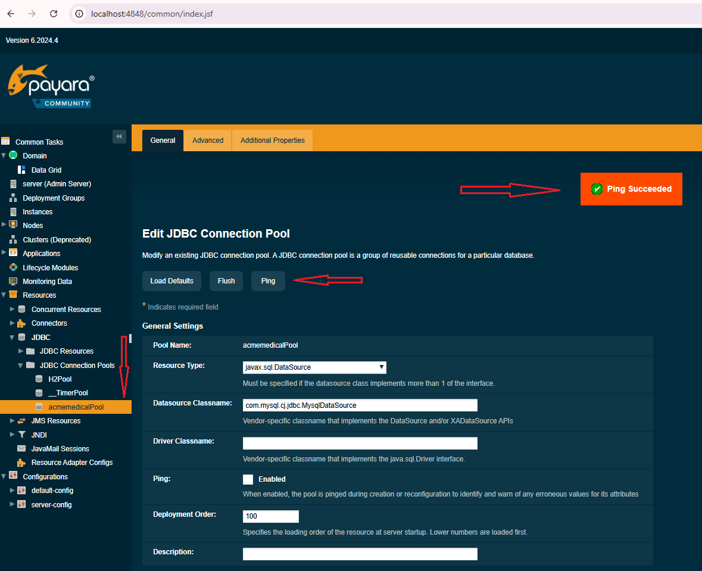

# ACME Medical RESTful API System

CST8277 Java Enterprise Project – Summer 2025  
Developed using Jakarta EE, Payara Server, JPA, and JAX-RS.

# Group Members and Task Distribution
| Member          | Contributions                                                                                                                           |  Average Peer Grade (Grade Provided by Group #) |
| --------------- |-----------------------------------------------------------------------------------------------------------------------------------------| ------------------------------------------------|
| Ruchen Ding     | Completed T1 (Entity Class JPA Mapping), T2 (User Authentication Logic Implementation), T3 (Establish User-Physician Relationship)      |             100 %                               | 
| Ryan Xu         | Completed T4 (REST API Implementation), T5 (Security Annotations), T7 (Postman Validation)                                              |             100 %                  	      | 
| Yizhen Xu       | Completed T6 (JUnit Testing), T8 (Documentation and Evaluation)                                                                         |             100%				      | 

---

## 1. Overview

This project models the medical training and certification system of ACME Medical Corp.  
It exposes RESTful APIs for managing Physicians, Patients, Medical Certificates, Prescriptions, Medicines, and more.

---

## 2. Technologies Used

- Java 21.0.1 2023-10-17 LTS
- Jakarta EE 10
- Payara Server 6.2024.4
- JPA / Hibernate
- MySQL 8.0.42
- Postman for Windows 11.55.1
- Eclipse IDE (with Maven support) 2025-03 (4.35.0)
- JUnit 5 + Maven Surefire

---

## 3. Setup & Deployment Instructions

### 3.1. Prerequisites

- Java JDK 17+
- Payara Server 6.2024+
- MySQL Server (or local MySQL Workbench)
- Eclipse IDE with Maven plugin
- Postman

### 3.2. Database Setup

The database schema undergoes a "drop-and-create" operation each time the application is deployed or restarted on Payara Server.

Required in persistence.xml by this property:
<property name="jakarta.persistence.schema-generation.database.action" value="drop-and-create"/>

The three SQL were provided in the project skeleton; don't modify them:
acmemedical-create.sql
acmemedical-data.sql
acmemedical-drop.sql

### 3.3. Payara Configuration
1. Run "localhost:4848" in browser
2. JDBC -> JDBC Connection Pools, create a new pool named "acmemedicalPool"
	- Resource Type: javax.sql.DataSource
	- Datasource Classname: com.mysql.cj.jdbc.MysqlDataSource
	- Additional Properties:
		- password: 8277
		- databaseName: acmemedical
		- serverName: 127.0.0.1
		- user: cst8277
		- networkProtocal: tcp
		- portNumber:3306
		- url: jdbc:mysql://localhost:3306/acmemedical?useSSL=false&allowPublicKeyRetrieval=true&serverTimezone=UTC

3. Save
4. Ping test

### 3.4. Security Roles
| Role         | Username  | Password |
| ------------ | --------- | -------- |
| `ADMIN_ROLE` | `admin`   | `admin`  |
| `USER_ROLE`  | `cst8277` | `8277`   |

### 3.5. REST Endpoints
Base URL: http://localhost:8080/rest-acmemedical/api/v1/

## 4 Testing with Postman
### 4.1 Steps
1. Import the REST-ACMEMedical-Sample.postman_collection.json file in POSTMAN.

2. Basic Auth can be changed during testing
	- Admin: admin:admin
	- User: cst8277:8277

3. Ensure correct port and endpoint paths

### 4.2 Special Notes
1. **MedicalTraining Entity**: embedded "DurationAndStatus"
2. **⚠️ POST of Prescription**:  The `Prescription` entity uses a **composite primary key** (Physician + Patient).
By default, the database contains:
- Physician ID = 1
- Patient IDs = 1 and 2
- Prescriptions for combinations (1,1) and (1,2)
Any attempt to create duplicate combinations will result in a primary key violation.

✅ To ensure POST of Prescription testing succeeds, our tests first create a new Physician (`ID = 2`),  
then use the combination `Physician = 2`, `Patient = 1` for the new Prescription.
Please run the requests **in order**, starting with the `POST Physician` request.

3. **⚠️ POST of MedicalCertificate**: The MedicalCertificate POST API implements business validation to prevent duplicate certificates for the same physician-training combination. Due to existing seed data, POST requests typically return 409 Conflict with a JSON error message, which is the expected and correct behavior. This demonstrates proper data integrity protection and structured error handling.
